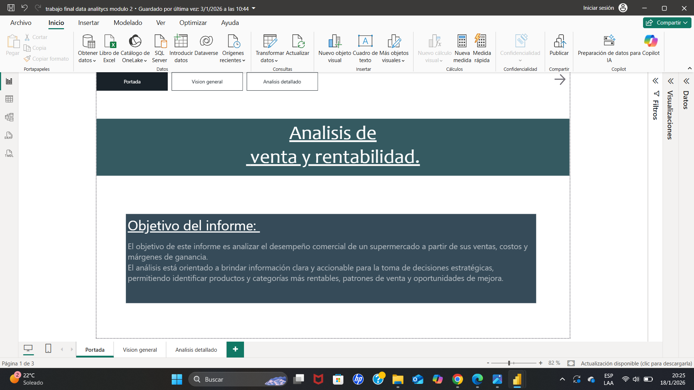
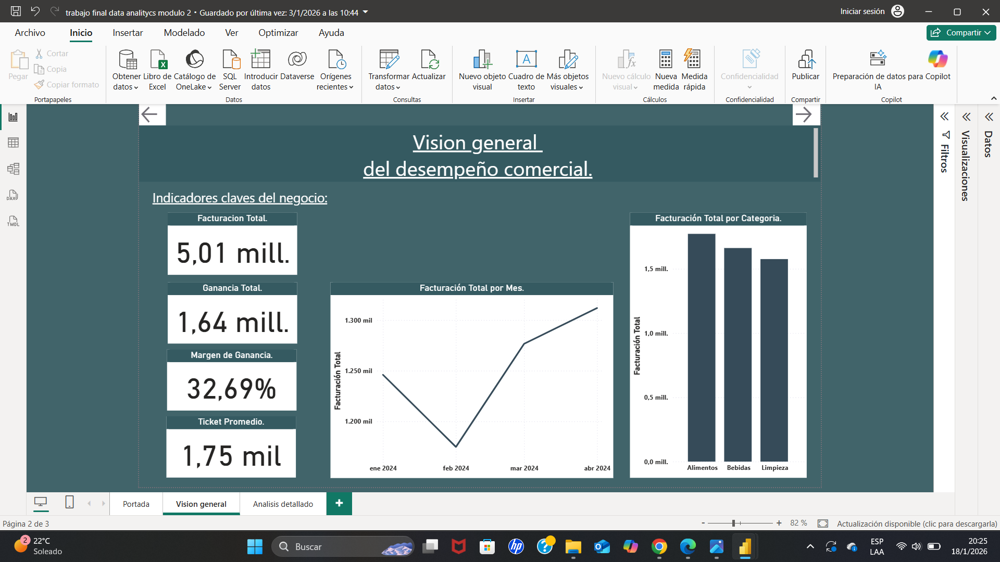
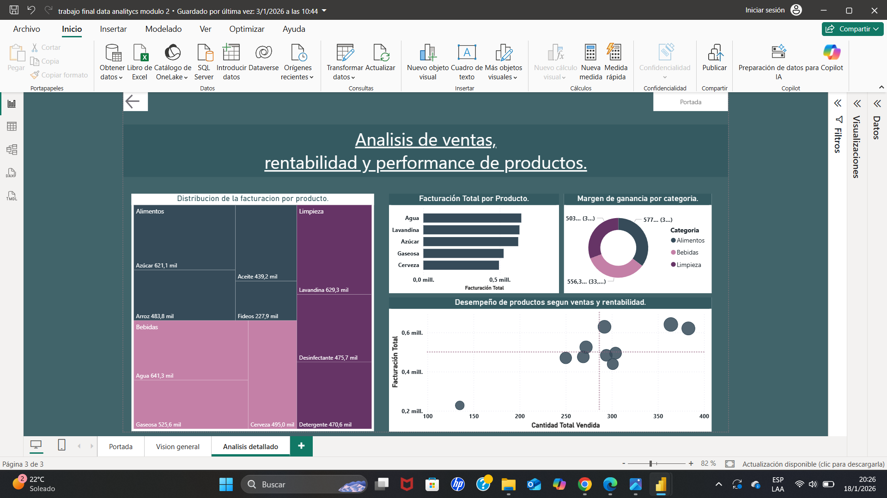

# 📊 Análisis de Ventas y Rentabilidad – Power BI

Este proyecto consiste en el desarrollo de un dashboard interactivo en Power BI para analizar el desempeño comercial de un supermercado a partir de sus ventas, costos y márgenes de ganancia.

## 🎯 Objetivo

Analizar el desempeño comercial para identificar productos y categorías más rentables, detectar patrones de venta y generar información útil para la toma de decisiones estratégicas.

## 🔧 Herramientas utilizadas

- Power BI  
- Excel  

## 📈 Análisis realizado

- Análisis de ventas y facturación  
- Evaluación de rentabilidad  
- Identificación de KPIs clave (facturación, ganancia, margen, ticket promedio)  
- Análisis de productos y categorías  
- Visualización interactiva mediante dashboard  

## 📊 Principales insights

- Identificación de productos con mayor facturación  
- Detección de categorías más rentables  
- Análisis de la evolución de ventas en el tiempo  
- Relación entre volumen de ventas y rentabilidad  

## 📊 Dashboard

